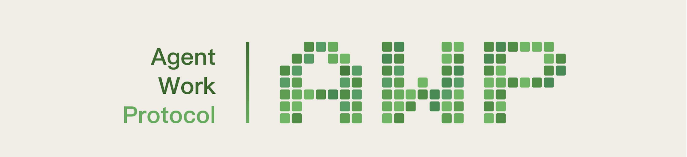

# AWP Skill

<p align="center">
  <a href="https://awp.pro/">
    
  </a>
</p>

<p align="center">
  
  
  
  
  
  
  
</p>

**Skill for interacting with the AWP (Agent Working Protocol) on EVM-compatible chains.** Query protocol state, bind and delegate, stake AWP tokens, manage worknets, create governance proposals, vote, and monitor real-time on-chain events — all through natural language.

### Works with

<p align="center">
  <a href="https://github.com/anthropics/claude-code"></a>
  &nbsp;
  <a href="https://github.com/openclaw/openclaw"></a>
  &nbsp;
  <a href="https://cursor.sh"></a>
  &nbsp;
  <a href="https://openai.com/codex"></a>
  &nbsp;
  <a href="https://ai.google.dev/gemini-api/docs/cli"></a>
  &nbsp;
  <a href="https://windsurf.ai"></a>
</p>

<p align="center">Any agent that supports the <a href="https://agentskills.io/specification">SKILL.md standard</a>.</p>

---

> **Testnet.** AWP is currently in testnet on Base. Multi-chain EVM deployment (Ethereum, Base, BSC, Arbitrum, etc.) is planned. Protocol parameters may change before the official mainnet launch.

## Overview

AWP is a decentralized **Agent Working** protocol deployed on 4 EVM chains (Base, Ethereum, Arbitrum, BSC). Users bind to a tree-based hierarchy, stake AWP via veAWP position NFTs, allocate to agents on worknets, and earn emissions. Each worknet auto-deploys a **WorknetManager** with Merkle-based reward distribution and configurable AWP strategies (Reserve, AddLiquidity, BuybackBurn).

This repository is a single skill with **20 actions**, **14 bundled scripts**, and **19 real-time event types** — covering Query, Staking, Worknet Management, Governance, and WebSocket Monitoring.

## Quick Install

```bash
skill install https://github.com/awp-core/awp-skill
```

The skill installs the [AWP Wallet](https://github.com/awp-core/awp-wallet) dependency on first load if missing.

## Features — 20 Actions

#### Query (read-only, no wallet needed)
| ID | Action | Description |
|----|--------|-------------|
| Q1 | Query Worknet | Get worknet info by ID (name, status, owner, worknet token, skills URI, min stake) |
| Q2 | Query Balance | Full staking overview — positions, allocations, unallocated balance |
| Q3 | Query Emission [DRAFT] | Current epoch, daily emission rate, decay projections (30/90/365 days) |
| Q4 | Query Agent | Agent info by worknet — stake, binding, reward recipient |
| Q5 | List Worknets | Browse active worknets with pagination, flag those with published skills |
| Q6 | Install Worknet Skill | Fetch a worknet's SKILL.md and install it for the agent to use |
| Q7 | Epoch History [DRAFT] | Historical epoch settlements with emission amounts |

#### Staking (wallet required)
| ID | Action | Description |
|----|--------|-------------|
| S1 | Bind & Set Recipient | Tree-based binding or set reward recipient. Supports gasless via EIP-712 relay. |
| S2 | Deposit AWP | Mint veAWP position with time-based lock. Add to position, withdraw on expiry. |
| S3 | Allocate / Deallocate / Reallocate | Direct stake to agents on worknets. One-click registerAndStake available. |

#### Worknet Management (wallet + AWPWorkNet ownership)
| ID | Action | Description |
|----|--------|-------------|
| M1 | Register Worknet | Deploy new worknet with worknet token + LP pool. Gasless option available. |
| M2 | Worknet Lifecycle | Activate, pause, resume, or cancel a worknet (with state pre-check) |
| M3 | Update Skills URI | Set the worknet's SKILL.md URL via AWPWorkNet NFT |
| M4 | Set Min Stake | Set minimum stake requirement for agents on the worknet |

#### Governance (wallet + veAWP positions)
| ID | Action | Description |
|----|--------|-------------|
| G1 | Create Proposal | Executable (via Timelock) or signal-only proposals |
| G2 | Vote | Cast votes with position NFTs. Anti-manipulation filtering built in. |
| G3 | Query Proposals | List and inspect governance proposals with on-chain enrichment |
| G4 | Query Treasury | Check DAO treasury address and AWP balance |

#### Monitor (real-time WebSocket, no wallet needed)
| ID | Action | Description |
|----|--------|-------------|
| W1 | Watch Events | Subscribe to real-time events via WebSocket with 5 presets + 5-min stats |
| W2 | Emission Alert [DRAFT] | Get notified on epoch settlements with top earner ranking |

### 19 Event Types (5 presets)

| Preset | Events | Count |
|--------|--------|-------|
| `staking` | Deposited, Withdrawn, Allocated, Deallocated, Reallocated | 5 |
| `worknets` | WorknetRegistered, WorknetActivated, WorknetCancelled | 3 |
| `emission` | EpochSettled | 1 |
| `users` | UserRegistered, Bound, Unbound, RecipientSet, DelegateGranted, DelegateRevoked | 6 |
| `protocol` | WorknetCancelled, and admin events | 2 |
| `all` | All of the above | 19 |

## Architecture

```
awp-skill/
├── SKILL.md                                # Main skill file (20 actions, UI templates)
├── references/
│   ├── api-reference.md                    # JSON-RPC endpoint index + contract quick reference
│   ├── commands-staking.md                 # S1-S3 command templates + EIP-712
│   ├── commands-subnet.md                  # M1-M4 command templates + gasless
│   ├── commands-governance.md              # G1-G4 commands + supplementary endpoints
│   └── protocol.md                         # Shared structs, 19 events, constants
├── scripts/
│   ├── awp-daemon.py                       # Background monitor: check deps, show status, notify updates
│   ├── awp_lib.py                          # Shared library (API, wallet, ABI, validation)
│   ├── wallet-raw-call.mjs                 # Node.js bridge: raw contract calls via awp-wallet
│   ├── relay-start.py                      # Gasless onboarding (bind or set-recipient)
│   ├── relay-register-subnet.py            # Gasless worknet registration (dual EIP-712)
│   ├── onchain-register.py                 # On-chain register (optional)
│   ├── onchain-bind.py                     # On-chain bind
│   ├── onchain-deposit.py                  # Deposit AWP (approve + deposit)
│   ├── onchain-allocate.py                 # Allocate stake
│   ├── onchain-deallocate.py               # Deallocate stake
│   ├── onchain-reallocate.py               # Reallocate stake (6-param safety)
│   ├── onchain-withdraw.py                 # Withdraw from expired position
│   ├── onchain-add-position.py             # Add AWP to existing position
│   ├── onchain-register-and-stake.py       # One-click register+deposit+allocate
│   ├── onchain-vote.py                     # Cast DAO vote (nested ABI encode)
│   ├── onchain-subnet-lifecycle.py         # Activate/pause/resume/cancel with state check
│   └── onchain-subnet-update.py            # Set skillsURI or minStake on AWPWorkNet
├── README.md
└── LICENSE
```

**Progressive loading**: The agent loads only what it needs per action. Query and Monitor actions use SKILL.md alone. Write actions load the specific command reference file, and all on-chain operations use bundled scripts — preventing manual calldata construction errors.

**14 bundled Python scripts** (+ shared `awp_lib.py` library) cover every write operation. Each script handles:

- Input validation (address regex, numeric bounds, uint128 range checks)
- Correct contract targeting (AWPRegistry vs veAWP vs AWPWorkNet vs AWPAllocator vs AWPDAO)
- Correct function selector (all verified via keccak256)
- Pre-checks (balance, state, expiry) before submitting transactions
- Unit conversion (human-readable AWP to wei, days to seconds)

## Gasless Support

Three operations support fully gasless execution via EIP-712 signatures and relay endpoints:

| Operation | Relay Endpoint | Signatures |
|-----------|---------------|------------|
| Bind (tree-based) | `POST /relay/bind` | 1 (EIP-712 Bind) |
| Set Recipient | `POST /relay/set-recipient` | 1 (EIP-712 SetRecipient) |
| Worknet Registration | `POST /relay/register-worknet` | 2 (ERC-2612 Permit + EIP-712 RegisterWorknet) |

Rate limit: 100 requests per IP per 1 hour across all relay endpoints.

The skill automatically checks ETH balance and routes to gasless relay when the wallet has no native gas.

## UX Features

The skill provides a polished user experience with:

- **ASCII art welcome screen** with quick start commands
- **4-step guided onboarding** — wallet setup, registration, subnet discovery, skill install
- **Option A / Option B** — Solo Mining (quick start) vs Delegated Mining (link wallet)
- **User commands** — `awp status`, `awp wallet`, `awp subnets`, `awp help`
- **Agent wallet model** — transactions execute directly (work wallet only, no personal assets)
- **Balance notifications** — auto-show +/- delta after balance-changing operations
- **Tagged output** — 11 prefixes: `[QUERY]`, `[STAKE]`, `[TX]`, `[NEXT]`, `[!]`, etc.
- **Transaction links** — every write shows txHash + BaseScan link
- **Session recovery** — auto-restore wallet, offer to resume WebSocket subscriptions
- **Monitor statistics** — 5-minute summaries during WebSocket watching
- **Error recovery** — clear messages with auto-recovery actions

## Agent Working — Quick Start

AWP supports two mining modes:

### Solo Mining
One address handles everything — staking, mining, and earning. No mandatory registration needed.

```
1. "start working" or "awp onboard"
2. Option A: Quick Start → auto-register
3. Pick a subnet → skill auto-installs
4. Start working immediately (min_stake=0 subnets)
```

### Delegated Mining (tree-based binding)
Two addresses with separated roles. Root manages funds (cold wallet), Agent executes tasks (hot wallet).

```
Root (cold wallet):                    Agent (hot wallet):
1. deposit AWP (S2)                    1. "start working" → Option B
2. allocate to Agent + worknet (S3)    2. bind(rootAddress) → rewards flow to root
3. grantDelegate(agent) if needed      3. pick worknet → start working
```

Note: `bind` already sets the reward path from the agent up to the root. Do not also call
`setRecipient` on the agent — it is redundant.

## Key Protocol Details

| Parameter | Value |
|-----------|-------|
| Chains | Base (8453), Ethereum (1), Arbitrum (42161), BSC (56) |
| Epoch Duration | 1 day (86,400 seconds) |
| Initial Daily Emission | 31,600,000 AWP per chain |
| Decay Factor | ~0.3156% per epoch |
| Emission Split | 50% recipients / 50% DAO |
| Token Decimals | 18 (all tokens) |
| Max Active Worknets | 10,000 per chain |
| Voting Power | `amount * sqrt(min(remainingTime, 54 weeks) / 7 days)` |
| Proposal Threshold | 1,000,000 AWP voting power |

## API Endpoints

| Service | URL |
|---------|-----|
| JSON-RPC API | `POST https://api.awp.sh/v2` |
| WebSocket | `wss://api.awp.sh/ws/live` |
| Health Check | `GET https://api.awp.sh/api/health` |
| Contract Registry | `registry.get` JSON-RPC method (returns all chains; pass `chainId` for one) |

## Smart Contracts

| Contract | Role |
|----------|------|
| **AWPRegistry** | Unified entry point — binding, delegation, worknet registration, lifecycle |
| **veAWP** | ERC721 position NFTs — deposit AWP with time-based lock |
| **AWPEmission** | Emission engine — daily epoch settlement via oracle [DRAFT] |
| **AWPAllocator** | Pure allocation logic — allocate, deallocate, reallocate |
| **AWPWorkNet** | Worknet identity ERC721 — on-chain name, skillsURI, minStake |
| **WorknetManager** | Auto-deployed per worknet — Merkle distribution + AWP strategies |
| **AWPDAO** | NFT-based governance — proposals, voting with position NFTs |
| **AWPToken** | ERC20 + ERC1363 + Votes — 10B max supply |
| **WorknetToken** | Per-worknet ERC20 via CREATE2 — 10B max per worknet |
| **Treasury** | TimelockController — DAO governance execution |

## Development

### Source Documents

Protocol specifications live on the `dev` branch (not included in the main install):

```bash
git checkout dev  # access skills-dev/ with contract-api.md, rest-api.md, config.md, ABIs, etc.
```

### Version History

| Version | Changes |
|---------|---------|
| 1.1.1 | Fix onchain-subnet-lifecycle selectors (pre-rename activate/pause/resume reverted on-chain); hardcode RPC_URL + User-Agent (public Base RPC blocks Python default UA, 403); `commands-subnet.md --worknet`→`--subnet`; `SKILL.md` version bump to 1.1.0; dead V1-API fallbacks removed; `split_sig`/`validate_uint128`/`validate_bytes32` moved to `awp_lib.py`; batch RPC helper (`rpc_call_batch`); daemon delegates to `awp_lib.rpc`; `short_addr` helper extraction; bare `except Exception` narrowed. |
| 1.1.0 | Contract rename: StakingVault→AWPAllocator, StakeNFT→veAWP, WorknetNFT→AWPWorkNet, AlphaTokenFactory→WorknetTokenFactory; new AWPDAO address; new registry field names; new EIP-712 domain `AWPAllocator/1`; relay endpoint rename `/relay/register-subnet`→`/relay/register-worknet`; `tokens.getAlpha*`→`tokens.getWorknetToken*`; worknetId format change `(chainId<<64)|localId`→`chainId*100_000_000+localId`. |
| 1.0.2 | `relay-start.py` split signature into v/r/s (relay rejects compact); add `chainId` to relay bodies; `skill-reference.md` LPManager address, `staking.getBalance` field `available`→`unallocated`, `emission.getEpochDetail` param fix, `chains.list` `status`→`dex`. |
| 1.0.1 | Fix registry.get array parsing, relay signature format (v/r/s), worknetManager field name |
| 1.0.0 | Multi-chain (Base/ETH/Arbitrum/BSC), JSON-RPC 2.0 API, Worknet terminology, 6 script bug fixes, skill description optimization |
| 0.25.8 | Security: eliminate all process.env from wallet-raw-call.mjs, use os.homedir() + well-known paths |
| 0.25.7 | Security: remove AWP_WALLET_DIR env var, use PATH + default paths only |
| 0.25.6 | Security: hardcode registry URL in wallet-raw-call.mjs, prevent env var allowlist bypass |
| 0.25.5 | Security: daemon opt-in, manual awp-wallet install, explicit ~/.awp file documentation |
| 0.25.4 | Code review fixes: registry fetch timeout, RECEIPT_WIDTH ordering, SKILL.md consistency |
| 0.25.3 | Fix daemon crash: `created_at` may be integer, not string |
| 0.25.2 | Description optimization — exclude other DeFi protocols on Base, 20/20 trigger eval |
| 0.25.1 | Security: contract allowlist in wallet-raw-call.mjs, transaction confirmation, daemon PID lifecycle |
| 0.25.0 | Unified English text, richer subnet display, cleaner notifications |
| 0.24.9 | Receipt-style welcome push (box-drawing borders), remove duplicate title from code block |
| 0.24.8 | Remove child_process from wallet-raw-call.mjs — pure Node.js PATH search, eliminates security scanner warning |
| 0.24.7 | Welcome title: "Hello World from the World of Agents!" (SKILL.md + daemon push) |
| 0.24.6 | Fix: onboarding must let user choose Option A/B (no auto-select); bind already sets reward path (no redundant setRecipient) |
| 0.24.5 | Code review (29 issues), notification redesign (benchmark-worker pattern), description optimization (20/20 trigger eval) |
| 0.24.4 | Fix daemon startup false positive (pgrep self-match), OpenClaw CLI discovery for non-PATH installs |
| 0.24.3 | Notification infra: daemon.log, status.json, `awp notifications` + `awp log` commands |
| 0.24.2 | Daemon: guided notifications with actionable next steps (wallet install/init/register/work) |
| 0.24.1 | Daemon: welcome push (banner + subnets via notify), new subnet detection notifications |
| 0.24.0 | Auto-start daemon on skill load; daemon no longer exits on missing deps (notifies + retries) |
| 0.23.2 | Fix install review: add node binary, separate optional env vars, clarify agent-initiated wallet init |
| 0.23.1 | Expanded skill description for better triggering accuracy |
| 0.22.9 | Security hardening: no auto-install/init in daemon, removed /tmp scanning, explicit wallet install via repo, simplified update notices, code review fixes |
| 0.22.0 | awp-wallet CLI compatibility: added `wallet-raw-call.mjs` bridge, fixed all on-chain scripts |
| 0.21.0 | All 14 shell scripts converted to Python + shared `awp_lib.py` library; dependencies reduced to python3-only |
| 0.20.7 | Deep review: fixed `awp-wallet receive` / `.eoaAddress`, injection fixes, daemon notify, multi-EVM support |
| 0.19.9 | Security audit: agent wallet model, Q6 trust model, shell injection fixes, registry null checks |
| 0.19.1 | Initial public release — 20 actions, 14 bundled scripts, gasless onboarding, 26 event types |

## Contributing

1. Switch to the `dev` branch and update source documents in `skills-dev/`
2. Regenerate skill files to match the updated specifications
3. Run eval tests to verify correctness
4. Submit a pull request to `main`

## License

[MIT](LICENSE)
